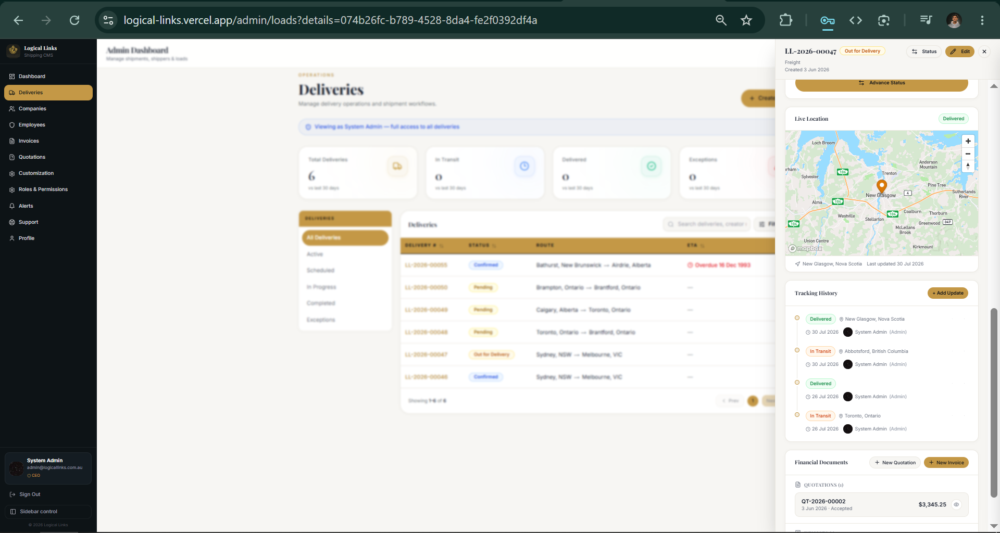

1. Map is working correctly, she didn't update the city as you can see in the 

2. He is asking to automaticaly determine the price from origin to destination, this requires API, and its not only about the cities, its by size of package, weight and other factors too, thatwhy its very odd to have automatic price calculations

3. As the quotations are linked with deliveries, and delivery has origin and destination, thatswhy its odd to have one thing in multiple places.

4. And he is asking to have full addresses in dropdowns like the crunch courier, it can be done by Google Maps API.

5. No table for price accroding to the distance

6. Again in quotation, she didnt select the shipper company to send. How it supposed to send to which company?

